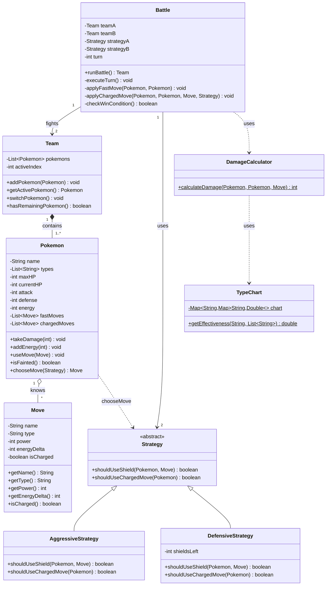

# Pokemon Go Team Comp Simulator — UML

```mermaid
classDiagram
    class Move {
        -String name
        -String type
        -int power
        -int energyDelta
        -boolean isCharged
        +getName() String
        +getType() String
        +getPower() int
        +getEnergyDelta() int
        +isCharged() boolean
    }

    class Pokemon {
        -String name
        -List~String~ types
        -int maxHP
        -int currentHP
        -int attack
        -int defense
        -int energy
        -List~Move~ fastMoves
        -List~Move~ chargedMoves
        +takeDamage(int) void
        +addEnergy(int) void
        +useMove(Move) void
        +isFainted() boolean
        +chooseMove(Strategy) Move
    }

    class Team {
        -List~Pokemon~ pokemons
        -int activeIndex
        +addPokemon(Pokemon) void
        +getActivePokemon() Pokemon
        +switchPokemon() void
        +hasRemainingPokemon() boolean
    }

    class Strategy {
        <<abstract>>
        +shouldUseShield(Pokemon, Move) boolean
        +shouldUseChargedMove(Pokemon) boolean
    }

    class AggressiveStrategy {
        +shouldUseShield(Pokemon, Move) boolean
        +shouldUseChargedMove(Pokemon) boolean
    }

    class DefensiveStrategy {
        -int shieldsLeft
        +shouldUseShield(Pokemon, Move) boolean
        +shouldUseChargedMove(Pokemon) boolean
    }

    class Battle {
        -Team teamA
        -Team teamB
        -Strategy strategyA
        -Strategy strategyB
        -int turn
        +runBattle() Team
        -executeTurn() void
        -applyFastMove(Pokemon, Pokemon) void
        -applyChargedMove(Pokemon, Pokemon, Move, Strategy) void
        -checkWinCondition() boolean
    }

    class DamageCalculator {
        +calculateDamage(Pokemon, Pokemon, Move)$ int
    }

    class TypeChart {
        -Map~String,Map~String,Double~~ chart$
        +getEffectiveness(String, List~String~)$ double
    }

    Team "1" *-- "1..*" Pokemon : contains
    Pokemon "1" o-- "*" Move : knows
    Battle "1" --> "2" Team : fights
    Battle "1" --> "2" Strategy : uses
    Battle ..> DamageCalculator : uses
    DamageCalculator ..> TypeChart : uses
    Pokemon ..> Strategy : chooseMove
    Strategy <|-- AggressiveStrategy
    Strategy <|-- DefensiveStrategy
```
